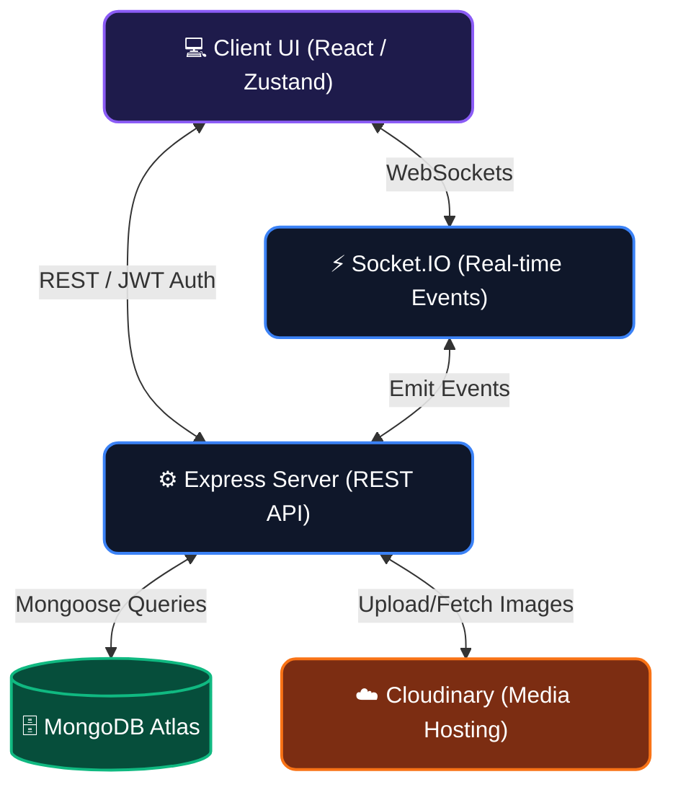

<div align="center">
  
  
  <h1 align="center">✨ Prism Chat ✨</h1>

  <p align="center">
    <strong>A stunning, real-time messaging web application featuring modern glassmorphism aesthetics.</strong>
  </p>

  <p align="center">
    <a href="https://prism-1f1n.onrender.com"><strong>🚀 View Live Deployment</strong></a>
  </p>

  <p align="center">
    
    
    
    
    
  </p>
</div>

<br />

## 🎨 Design Philosophy
Prism Chat is designed to be visually breathtaking. Moving away from flat, lifeless interfaces, Prism uses **Glassmorphism**, vibrant gradients, and fluid animations to create an interface that feels alive. 
- **Dynamic Backgrounds**: Midnight blue gradients that give depth.
- **Frosted Glass Panels**: Semi-transparent panels with background blur (`backdrop-blur-xl`) that create a hierarchy of layered elements.
- **Rounded & Friendly**: Extensive use of large border radii (`rounded-3xl`) for a soft, approachable feel.
- **Multiple Themes**: Seamless switching between themes (Dark, Synthwave, Cyberpunk, Forest, etc.) using daisyUI.

---

## 🛠 Tech Stack
### **Frontend**
- **React 19** & **Vite**: Ultra-fast development and optimized production builds.
- **Tailwind CSS v4** & **daisyUI v5**: Utility-first styling with robust pre-built component themes.
- **Zustand**: Lightweight, frictionless global state management.
- **React Router v7**: Declarative routing.
- **Lucide React**: Crisp, modern iconography.

### **Backend**
- **Node.js** & **Express**: Robust REST API framework.
- **MongoDB** & **Mongoose**: Flexible NoSQL database and object modeling.
- **Socket.io**: Real-time, bidirectional, event-based communication.
- **Cloudinary**: Cloud-based image and media management.
- **JWT & bcrypt**: Secure authentication and password hashing.

---

## 📊 Application Architecture & Flow


---

## 🔑 Environment Variables (.env)

To run this project locally, you will need to set up a `.env` file in your `backend` directory.

### Structure of `backend/.env`
```env
# Server Configuration
PORT=5001
NODE_ENV=development

# Database Configuration
MONGODB_URI=your_mongodb_connection_string

# Authentication Secrets
JWT_SECRET=your_super_secret_jwt_key

# Cloudinary Configuration
CLOUDINARY_CLOUD_NAME=your_cloud_name
CLOUDINARY_API_KEY=your_api_key
CLOUDINARY_API_SECRET=your_api_secret
```

### Where to get your API Keys:
1. **MongoDB URI (`MONGODB_URI`)**:
   - Go to [MongoDB Atlas](https://www.mongodb.com/cloud/atlas/register)
   - Create a free cluster, set up a database user, and allow access from anywhere (`0.0.0.0/0`).
   - Click "Connect" -> "Connect your application" and copy the connection string. Replace `<password>` with your user's password.
2. **Cloudinary Keys (`CLOUDINARY_*`)**:
   - Go to [Cloudinary](https://cloudinary.com/users/register/free)
   - Sign up for a free account.
   - Go to your Dashboard. Your **Cloud Name**, **API Key**, and **API Secret** will be prominently displayed at the top of the page.
3. **JWT Secret (`JWT_SECRET`)**:
   - This can be any random, secure string. You can generate one in your terminal using: `node -e "console.log(require('crypto').randomBytes(32).toString('hex'))"`

---

## 🚀 Local Development Setup

Follow these detailed, step-by-step instructions to get the project running on your local machine.

### Prerequisites
- [Node.js](https://nodejs.org/en/) (v18 or higher recommended)
- [Git](https://git-scm.com/)
- A MongoDB cluster and Cloudinary account (see above)

### 1. Clone the Repository
```bash
git clone https://github.com/banerjee2080/Prism-the-chat-app.git
cd Prism-the-chat-app
```

### 2. Install Dependencies
This project uses a root script to install both frontend and backend dependencies simultaneously.
```bash
npm run build
```
*(Alternatively, you can manually run `npm install` inside both the `frontend` and `backend` directories).*

### 3. Configure Environment Variables
- Navigate to the `backend` directory:
  ```bash
  cd backend
  ```
- Create a file named `.env`.
- Paste the environment variables structure provided above and fill in your actual API keys.
- Return to the root directory:
  ```bash
  cd ..
  ```

### 4. Run the Development Servers
You will need to run the backend and frontend separately during development.

**Terminal 1: Start the Backend Server**
```bash
cd backend
npm run dev
```

**Terminal 2: Start the Frontend Application**
```bash
cd frontend
npm run dev
```

### 5. Access the App
Open your browser and navigate to:
**[http://localhost:5173](http://localhost:5173)**

You are now ready to chat, customize themes, and explore the glassmorphic UI! Enjoy! ✨
